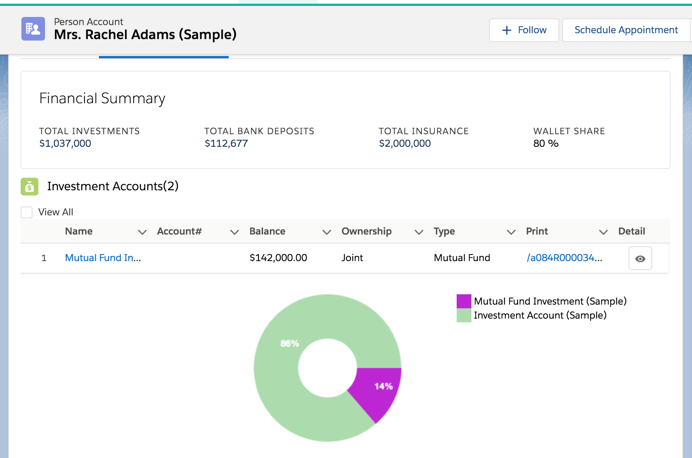
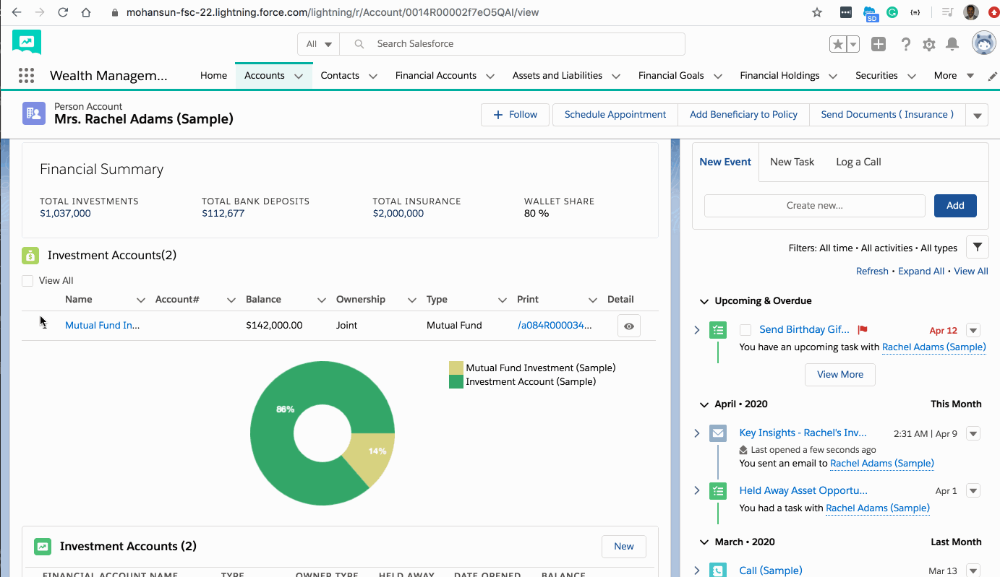

## Component to show the Financial Accounts in FSC 

1. [Features](#features)
2. [Screenshots](#screenshots)
3. [Demos](#demos)

<hr>
<a name="features"></a>
### Features
- Configurable for the required Financial Account Type
- Built-in **View All** feature
- Sorting on **Balance** supported
- Doughnut Chart 
- RESTful call to get latest Account Balance
- Summary support (grid or table)


<a name="screenshots"></a>
### Screenshots

#### In App builder


#### In Financial Accounts tab


##### View All Clicked


#####  Details


#####  Print View


##### Balanced Sorted 


##### Summary feature (grid or table format)
- Summary grid


- Summary table


- Summary setup in App Builder 


<a name=screenshots"></a>
### Demos


### Demo showing getting latest Account Balance from RESTful service



### Demo showing summary feature


### Source code
```
src
└── force-app
    └── main
        └── default
            ├── classes
            │   ├── FAData.cls
            │   └── FAData.cls-meta.xml
            └── lwc
                ├── faBalUtil
                │   ├── faBalUtil.html
                │   ├── faBalUtil.js
                │   └── faBalUtil.js-meta.xml
                ├── faItem
                │   ├── faItem.html
                │   ├── faItem.js
                │   └── faItem.js-meta.xml
                └── faList
                    ├── Canvas.js
                    ├── faList.css
                    ├── faList.html
                    ├── faList.js
                    └── faList.js-meta.xml

```

### Deploy using SFDX

- Go to src folder

- Deploy lwc using these lines
```
sfdx force:source:deploy -p force-app/main/default/lwc/faBalUtil  -u  your_username.force.com
sfdx force:source:deploy -p force-app/main/default/lwc/faItem     -u  your_username.force.com
sfdx force:source:deploy -p force-app/main/default/lwc/faList     -u  your_username.force.com

```

- Deploy Apex Controller using this line

```
sfdx force:source:deploy -p force-app/main/default/classes/FAData.cls -u  your_username.force.com 

```

- Use App Builder to configure this component (faList)
