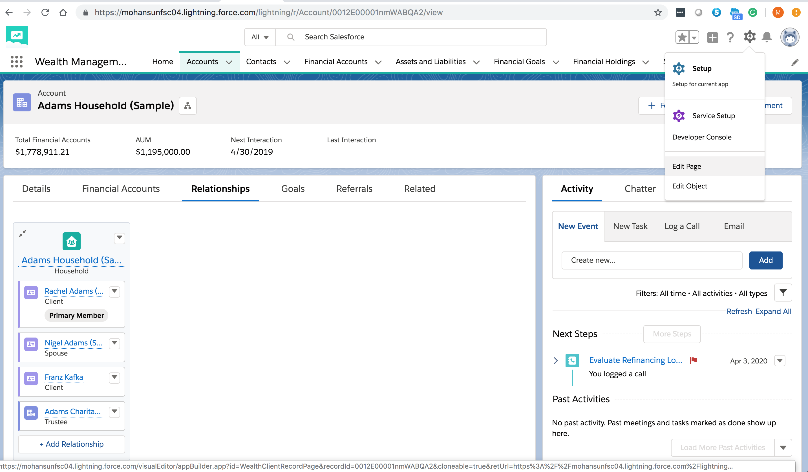

### Simple aura component to toggle UI elements in FSC Relationship Map

<a href='https://mohan-chinnappan-n2.github.io/2019/fsc-faq/faq-1.html#FSC%20UI%20Config' style='font-size:20px;' target='_blank'>Demos</a>

### Install using SFDX

- Download the zip from this Repo
- Merge force-app folder content into your DX project

- For Sandbox/DE/PROD: Establish connection with:
   - In the case of sandbox  use :    ```   sfdx force:auth:web:login -r https://test.salesforce.com ```
   - In the case of  PROD or DE use : ```   sfdx force:auth:web:login -r https://login.salesforce.com ```


- Deploy  using SFDX (for  -u --put your login username--)
```
 sfdx force:source:deploy -u loginUsername@email.com -p force-app/main/default/aura
 sfdx force:source:deploy -u loginUsername@email.com -p force-app/main/default/staticresources
 ```

 - Install this component using App Builder by **Edit Page** 

 
 
