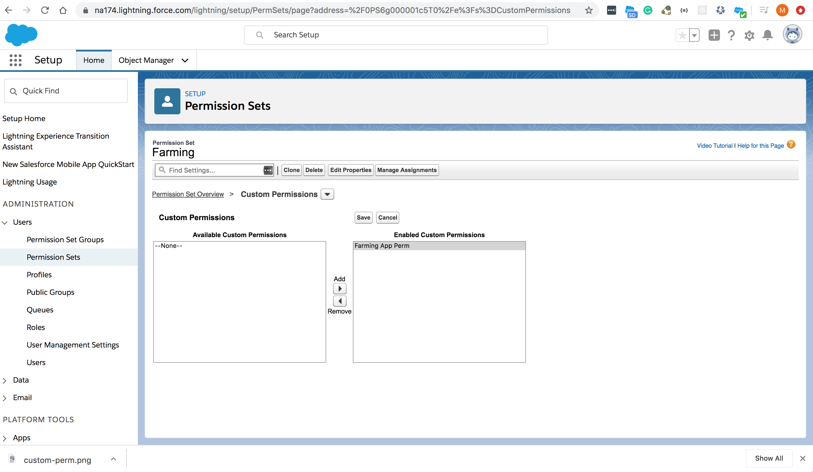

## Following screens show how to use a Custom Perm to filter a component in a Lightning Page

### Create Custom Perm

### Filter the component on the Lightning Page using this Custom Perm

	
### Assign a custom perm to Perm Set

	
### Filter the component on the Lightning Page using this Standard Perm

	

### Links
- [Custom Permission](https://help.salesforce.com/articleView?id=custom_perms_overview.htm&type=5)
