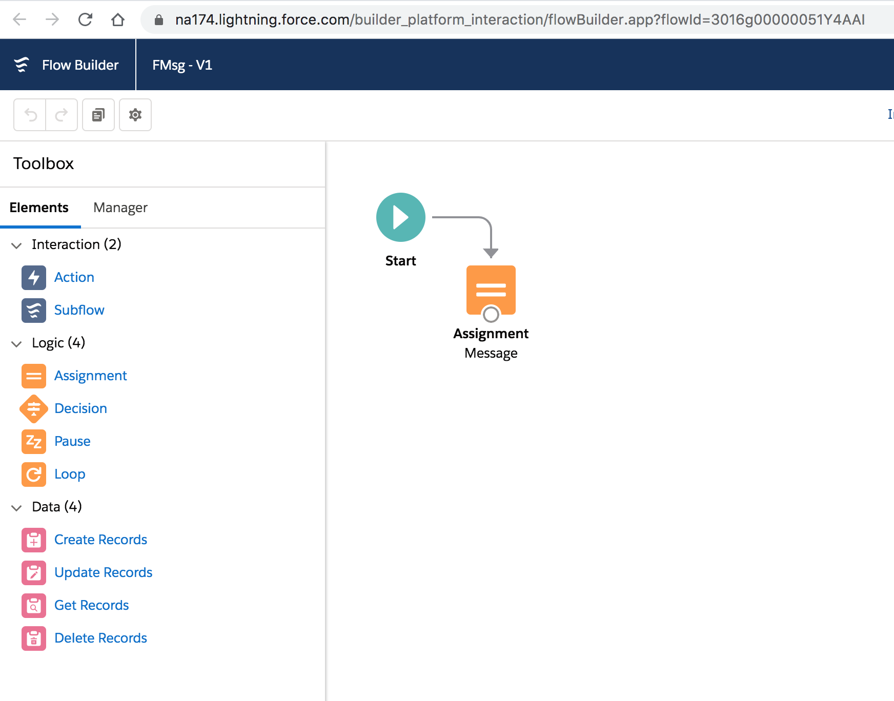
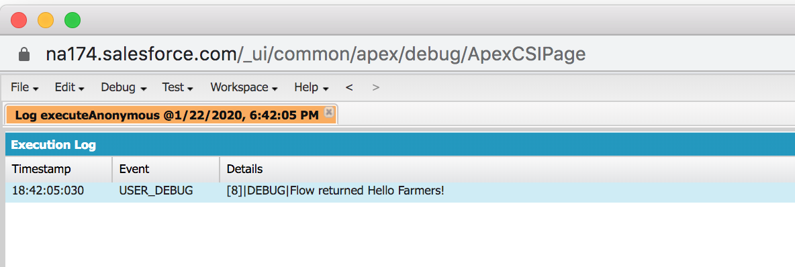
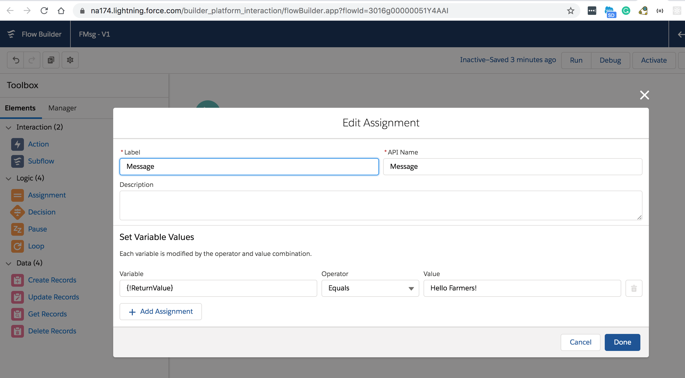
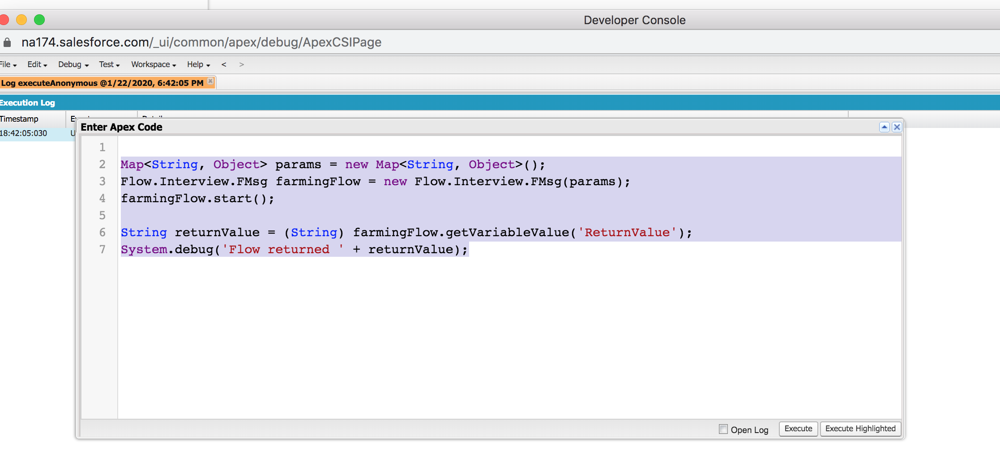

## Calling flow in Apex Anonymous block








```

Map<String, Object> params = new Map<String, Object>();
Flow.Interview.FMsg farmingFlow = new Flow.Interview.FMsg(params);
farmingFlow.start();
 
String returnValue = (String) farmingFlow.getVariableValue('ReturnValue');
System.debug('Flow returned ' + returnValue);

```
### References

- [Invoke a Flow with Apex](https://developer.salesforce.com/docs/atlas.en-us.salesforce_vpm_guide.meta/salesforce_vpm_guide/vpm_distribute_system_apex.htm)

