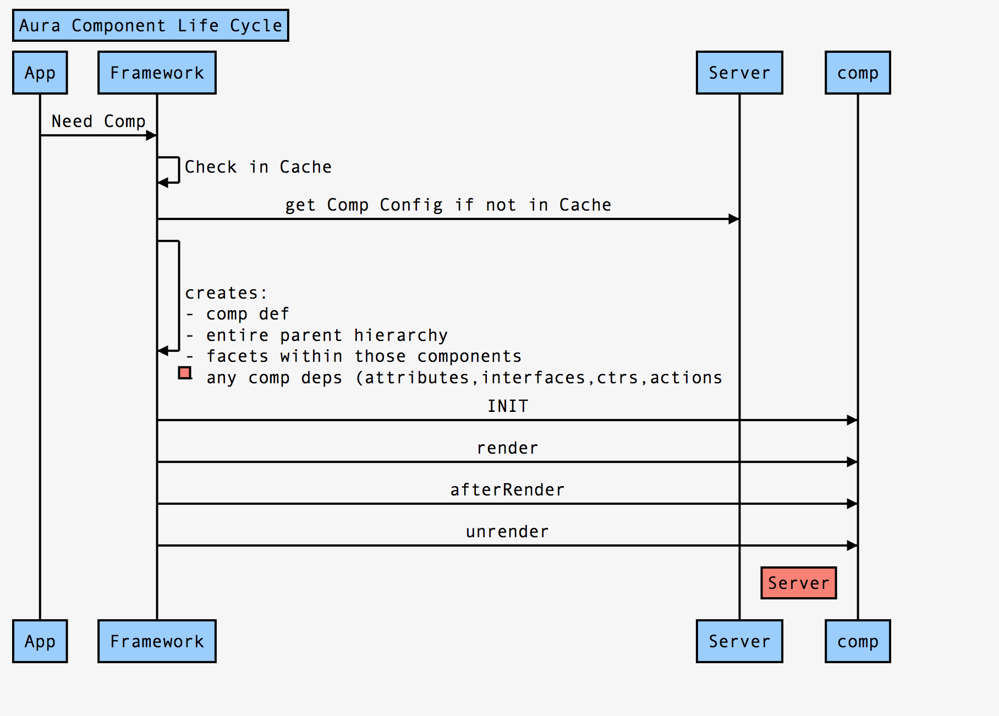

## Aura Component Life Cycle

- init Event
- render
- afterRender
- unrender




- The rendering lifecycle happens once in the lifetime of a component unless the component gets explicitly unrendered.
- When you create a component:
    - The component service that constructs the components fires the init event to signal that initialization has completed.
    - You can customize the init handler and add your own controller logic before the component starts rendering. 
    - ``` <aura:handler name="init" value="{!this}" action="{!c.doInit}"/> ```
 
- For each component in the tree, the base implementation of render() or your custom renderer is called to start component rendering
    - rendering starts at the root component, its children components and their super components, if any, and finally the subchildren components.

- Once your components are rendered to the DOM, afterRender() is called to signal that rendering is completed for each of these component definitions. 
    - It enables you to interact with the DOM tree after the framework rendering service has created the DOM elements.


- The framework fires a render event, enabling you to interact with the DOM tree after the framework’s rendering service has inserted DOM elements

- Finally, the aura:doneRendering event is fired at the end of the rendering lifecycle.

### References

- [Events Fired During the Rendering Lifecycle](https://developer.salesforce.com/docs/atlas.en-us.lightning.meta/lightning/components_lifecycle.htm)


