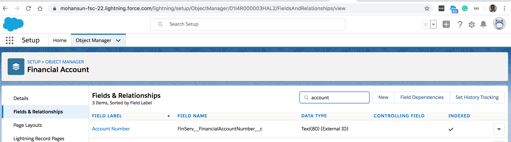

### Encrypting the  FinServ__FinancialAccount__c.FinServ__FinancialAccountNumber__c 

- This field is marked as ExternId

- To encrypt custom fields that have the Unique or External ID attribute, you can only use deterministic encryption. [Refer](https://help.salesforce.com/articleView?id=security_pe_custom_fields.htm&type=5)

- Another **possible** solution is:
    - Create an alias for your Enterprise Account Number and use that in  FinServ__FinancialAccount__c.FinServ__FinancialAccountNumber__c
    - Aliasing algorithm will be owned by the Enterprise and kept secret by the enterprise
    - Example:
        - Enterprise Account Number: JohnDoeS13434
        - After applying Enterprise Aliasing algorithm it becomes: 234N3444 
            - This value 234N3444 is stored as FinServ__FinancialAccount__c.FinServ__FinancialAccountNumber__c   

