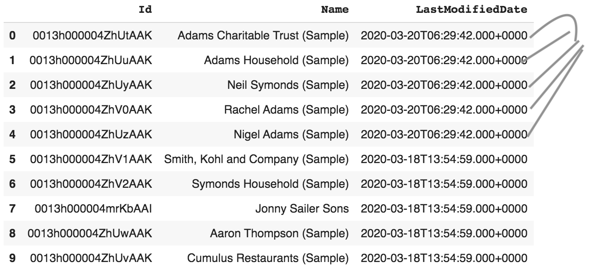

## FSC Household Rollup for the given Household in realtime

### Overview
- System performs on-demand rollup required for the Household the user currently viewing
- Makes use of the out-of-the-box FSC RBL configs to trigger the required rollups for the household in context 


 
### Demo


### Updated Accounts - note the updated dates



### Setup requirements

1. We have used this feature for ```FinServ__FinancialAccount__c``` related RBLS (```FinServ__RollupByLookupConfig__c```)

- One-time step up via script ( DX can be used) to update the ```FinServ__UpdateOnChange__c``` in ```FinServ__RollupByLookupConfig__c``` object
    - Currently done for the records in ```FinServ__RollupByLookupConfig__c WHERE FinServ__FromObject__c = 'FinancialAccount__c```   
    - ```FinServ__ProcessType__c``` is set to ```Realtime```
    - ```FinServ__Active__c is``` set to ```True```

- 

- Example RBL:
- 

2. Custom Field **Rollup_Toggle__c** needs to be created in the object FinServ__FinancialAccount__c


- When the rollup for the household happens the value Rollup_Toggle__c is updated to trigger the rollup 
 

- Make sure: **Rollup_Toggle__c** does not get updated during daily bulk load 

### Component  HHRollup.cmp

```xml

<aura:component controller='HHRollupCtrl'
                implements="force:appHostable,flexipage:availableForAllPageTypes,flexipage:availableForRecordHome,force:hasRecordId,forceCommunity:availableForAllPageTypes,force:lightningQuickAction" access="global" >
    <aura:attribute name="recordId" type="String" />
    <aura:attribute name="status" type="String" default="none" />
    <!-- <lightning:button variant="brand"  title="Perform Household Rollup "  label="Perform Household Rollup" onclick="{! c.performRollup }"/> -->
    
    <aura:handler name='init' value='{!this}' action='{!c.performRollup}' description = 'Performs Household Rollup' />
    <lightning:card footer="FSC Household Rollup" title="">
        <aura:if isTrue="{!v.status !='none' }">
            <span class="slds-p-horizontal_small"> <p>{!v.status}</p> </span>
        </aura:if>
    </lightning:card>
</aura:component>

```

### Controller HHRollupController.js

```js
({
	performRollup : function(component, event, helper) {
		 var action = component.get('c.toggle'); 
         action.setParams({
            "accountId" : component.get('v.recordId') 
        });
        action.setCallback(this, function(a){
            var state = a.getState(); // get the response state
            if(state === 'SUCCESS') {
                component.set('v.status', a.getReturnValue());
            }
        });
        $A.enqueueAction(action);
	}
})
```

### Apex Controller HHRollupCtrl

```java
public with sharing class HHRollupCtrl {
    @AuraEnabled
    public static String toggle(String accountId) {
        String status = 'Going to do rollup';
        FinServ__FinancialAccount__c[] fas = [
            SELECT Id, Rollup_Toggle__c
                    FROM FinServ__FinancialAccount__c
                    WHERE FinServ__PrimaryOwner__c= :accountId OR FinServ__JointOwner__c = :accountId
        ];

        for (FinServ__FinancialAccount__c fa : fas) {
            Integer randomNumber = Integer.valueof((Math.random() * 100000));
            fa.Rollup_Toggle__c = randomNumber;
        }
        update fas;
        status = 'Rollup Completed!';
        return status;
    }
}
```


### App Builder


###  Limitations
- Since the rollup are calculated on-demand basis
    - List view or FSC App for EA or Salesforce reports covering across the houseolds may be inconsistent as some household may have old rollup values

 
### TODOs
- We can make the Rollups can happen only once a day (by a custom field say ```last_hh_rolup_calc_date__c``` in the Account record for the household)
- The component should check this field, if it is beyond update period (example: 24 hours, or less than today, can be put in a custom settings) then rollup will be triggered
    - currently rollup for the household in context  is triggerd eveytime household is visited by the user

### References

- [FinServ__RollupByLookupConfig__c](https://mohan-chinnappan-n.github.io/sfdc/fs-cloud/csv-viewer_fsc.html?f=FinServ__RollupByLookupConfig__c)
- [FinServ__FinancialAccount__c](https://mohan-chinnappan-n.github.io/sfdc/fs-cloud/csv-viewer_fsc.html?f=FinServ__FinancialAccount__c)
- [Account](https://mohan-chinnappan-n.github.io/sfdc/fs-cloud/csv-viewer_fsc.html?f=Account)
- [FSC Data Model interactive](https://mohan-chinnappan-n.github.io/sfdc/fs-cloud/model-fsc-224.html)
- [FinServ__RollupByLookupConfig__c](https://mohan-chinnappan-n.github.io/sfdc/fs-cloud/csv-viewer_fsc.html?f=FinServ__RollupByLookupConfig__c)
- [FinServ__RollupByLookupFilterCriteria__c](https://mohan-chinnappan-n.github.io/sfdc/fs-cloud/csv-viewer_fsc.html?f=FinServ__RollupByLookupFilterCriteria__c)
- [FSC Admin Guide](https://developer.salesforce.com/docs/atlas.en-us.financial_services_cloud_admin_guide.meta/financial_services_cloud_admin_guide/fsc_admin.htm)
- [Rollup notes](https://mohan-chinnappan-n2.github.io/2020/fsc/rollup/rbl/fsc-rollup.html)
