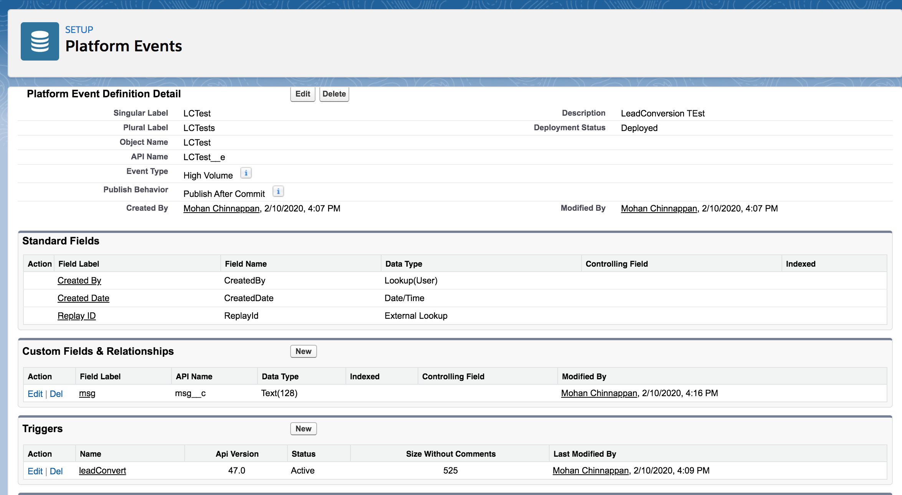
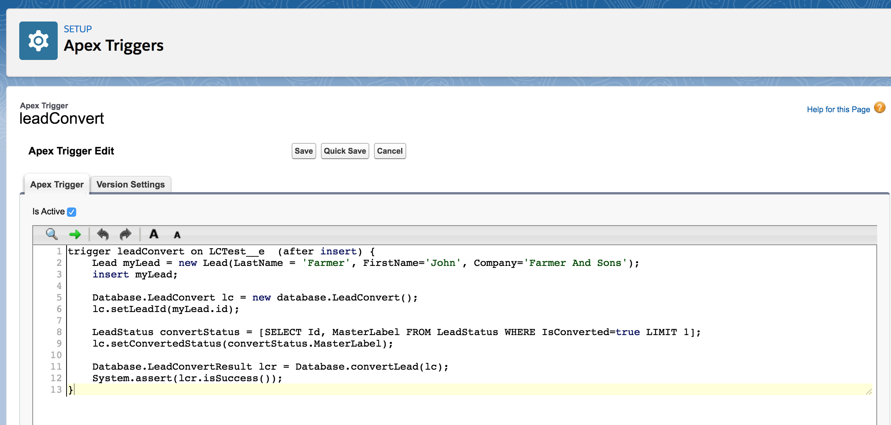
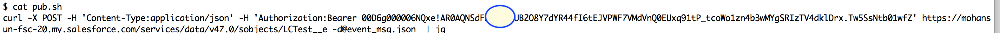
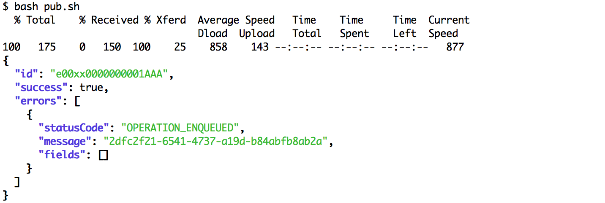
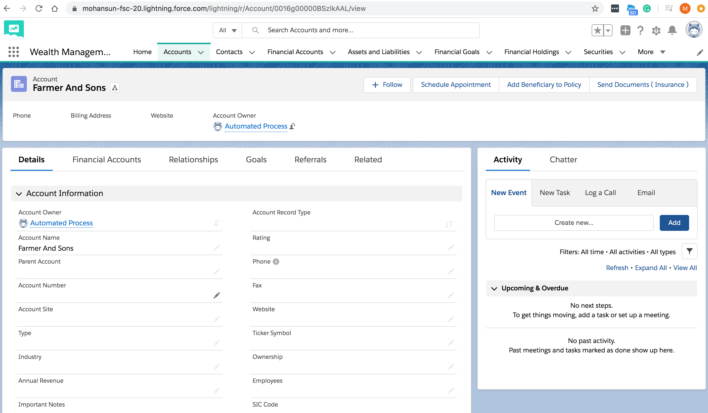

## Using Platform Events to do Lead Conversion


### Setup Platform Event object (LCTest__e)


### Trigger for Platform Event 

```java

trigger leadConvert on LCTest__e  (after insert) {
    Lead myLead = new Lead(LastName = 'Farmer', FirstName='John', Company='Farmer And Sons');
    insert myLead;
    
    Database.LeadConvert lc = new database.LeadConvert();
    lc.setLeadId(myLead.id);
    
    LeadStatus convertStatus = [SELECT Id, MasterLabel FROM LeadStatus WHERE IsConverted=true LIMIT 1];
    lc.setConvertedStatus(convertStatus.MasterLabel);
    
    Database.LeadConvertResult lcr = Database.convertLead(lc);
    System.assert(lcr.isSuccess());
}

```

### Publish the event 
- payload
```
{
  "msg__c": "Convert"
}
```



### Account Creation


### Contact Creation


