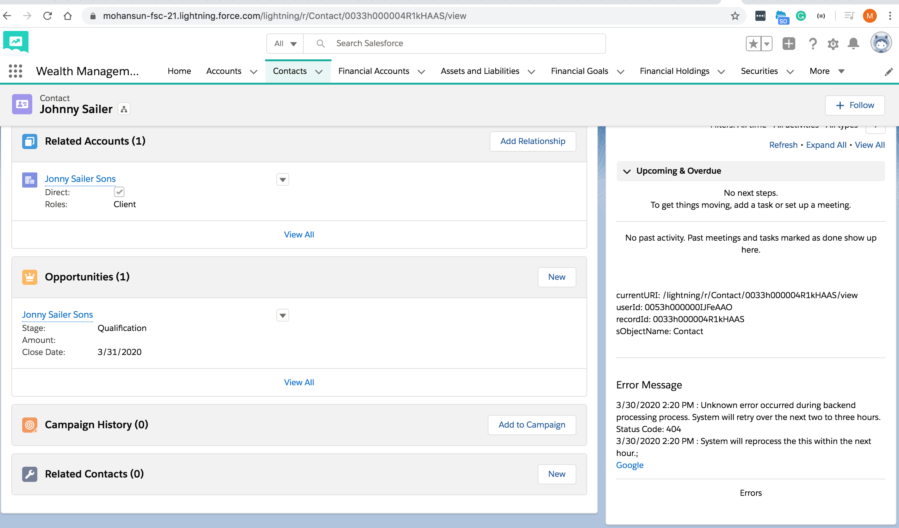

## How to get current URI, userId, recordId, sObjectName in Aura Lightning Component


 
### Component

``` xml
<aura:component implements="force:hasSObjectName,force:appHostable,flexipage:availableForAllPageTypes,flexipage:availableForRecordHome,force:hasRecordId,forceCommunity:availableForAllPageTypes,force:lightningQuickAction" access="global" >
    <aura:handler name="init" value="{!this}" action="{!c.doInit}"/>
    <aura:attribute name="currentURI" default="none" type="String" />
    <aura:attribute name="userId" default="none" type="String" />
    
    <aura:attribute name="sObjectName" type="String"/>
    <aura:attribute name="recordId" default="none" type="String" />
    
    <aura:attribute name="errorMsg"  default="none" type="String"/>

    <p>currentURI: {!v.currentURI}</p>
    <p>userId: {!v.userId}</p>
    <p>recordId: {!v.recordId}</p>
    <p>sObjectName: {!v.sObjectName}</p>

    <hr/>
    <lightning:card footer="Errors" title="Error Message">
    	<aura:unescapedHtml value="{!v.errorMsg}"/>
    </lightning:card> 

</aura:component>
```

### Controller

```js
({
    doInit : function(component, event, helper) {
        component.set('v.currentURI', window.location.pathname);
        component.set('v.userId',  $A.get( "$SObjectType.CurrentUser.Id" ));
        const errorMsg = `
        3/30/2020 2:20 PM : Unknown error occurred during backend processing process. System will retry over the next two to three hours. Status Code: 404
        <br>3/30/2020 2:20 PM : System will reprocess the this  within the next hour.;
        <br><a href='https://google.com'>Google</a>

        `;
        component.set('v.errorMsg', errorMsg);

        
    }
})
```


## How to use text-overflow in aura:unescapedHtml

```css
.THIS .overflow-visible {
  white-space: initial;
  width:300px;
}

```

```xml
 <p class='overflow-visible'>
    <aura:unescapedHtml  value="{!v.errorMsg}"/>
 </p>
```


 
