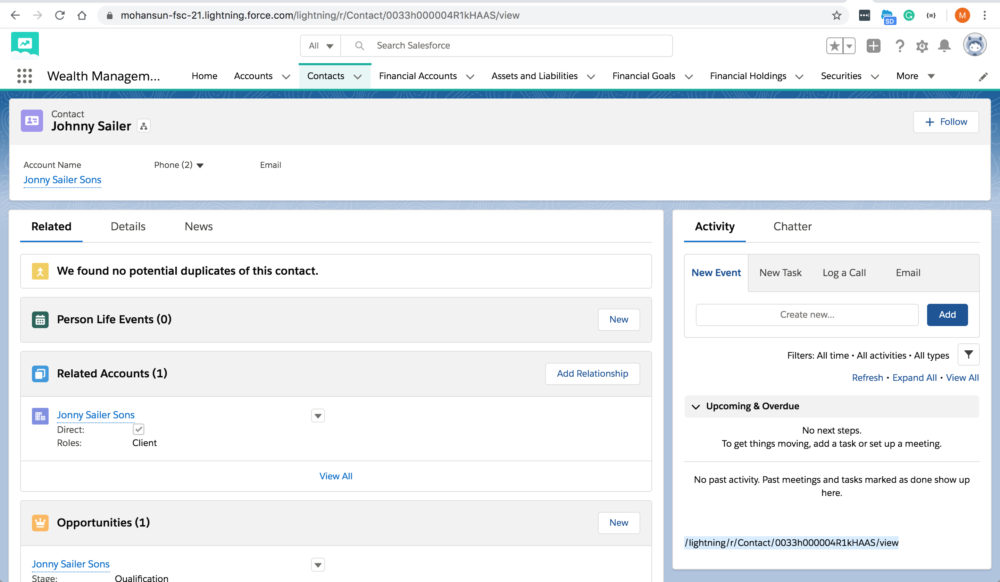

## How to get current URI in Aura Lightning Component




### Component

``` xml
<aura:component implements="force:appHostable,flexipage:availableForAllPageTypes,flexipage:availableForRecordHome,force:hasRecordId,forceCommunity:availableForAllPageTypes,force:lightningQuickAction" access="global" >
    <aura:handler name="init" value="{!this}" action="{!c.doInit}"/>
    <aura:attribute name="currentURI" default="none" type="String" />
    <p>{!v.currentURI}</p>
</aura:component>
```

### Controller

```js

({
	doInit : function(component, event, helper) { component.set('v.currentURI', window.location.pathname); }
})


```
