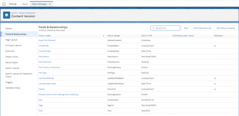
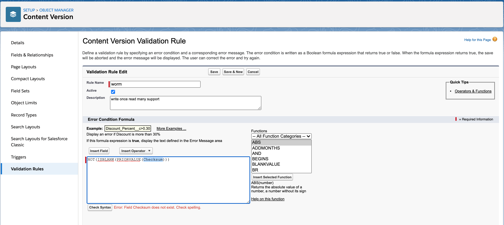

1. If we support validation on the attachments (ContentVersion), we can achieve WORM to some level.
    - With validation rule, we can block the overwrite of the document.
    - example ```NOT(ISBLANK(PRIORVALUE( ContentVersion.Checksum)))```

    - Currently this Checksum field is not exposed in Object Manager and not visible in Validataion Rules
    - 
    - 


2. If we introudce a configuration flag in the settings:
    - Make  ```ContentVersion.Checksum ``` immutable 

