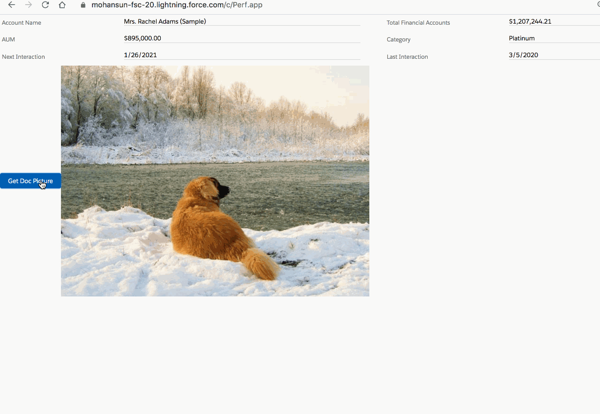

## How to make External Service Call in Aura Components





### App (Perf.app)

``` xml
<aura:application extends="force:slds">
    <c:PerfComp />
</aura:application>

```
### Component (PerfComp.cmp)

``` xml

<aura:component implements="force:appHostable,flexipage:availableForAllPageTypes,flexipage:availableForRecordHome,force:hasRecordId,forceCommunity:availableForAllPageTypes,force:lightningQuickAction" access="global" >
    
  
   <aura:attribute name="dogImg" default="someimg" type="String" />
    


    <lightning:recordForm
                          recordId="0016g00000B6BSHAA3"
                          objectApiName="Account"
                          layoutType="Compact" mode="readonly"
                          columns="2"/>
    
    
    <lightning:button variant="brand" label="Get Doc Picture" 
                      title="Get Doc Picture" 
                      onclick="{! c.getDogPic }" />
    
    
    
    
 
    
    
    
    
</aura:component>


```

### Controller (PerfCompController.js)

``` js
({
   getDogPic: function(cmp, event, helper) {
        helper.getDogPicService(cmp);
    }
    
    
})

```

### Helper (PerfCompHelper.js)

``` js
({
   getDogPic: function(cmp, event, helper) {
        helper.getDogPicService(cmp);
    }
    
    
})

```

### CSP Trusted Sites

