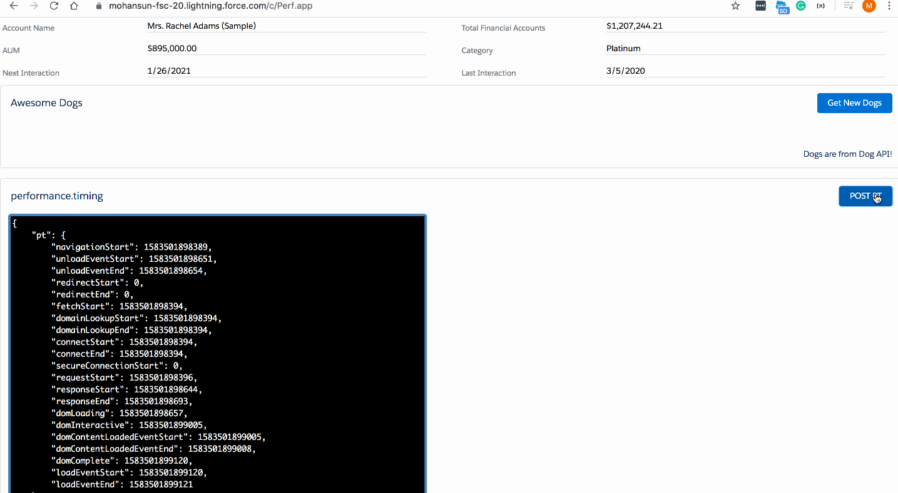
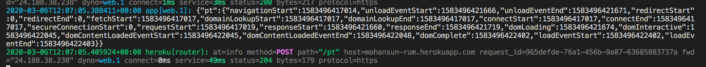

## How to make External Service Call in Aura Components





### App (Perf.app)

``` xml
<aura:application extends="force:slds">
    <c:PerfComp />
</aura:application>

```
### Component (PerfComp.cmp)

``` xml
<aura:component implements="force:appHostable,flexipage:availableForAllPageTypes,flexipage:availableForRecordHome,force:hasRecordId,forceCommunity:availableForAllPageTypes,force:lightningQuickAction" access="global" >
    <aura:attribute name="dogImg" default="someimg" type="String" />
    <aura:attribute name="dogImg2" default="someimg" type="String" />
    
    <aura:attribute name="timenow" default="sometime" type="String" />
    
    <aura:attribute name="pt" default="somept" type="String" />
    <aura:attribute name="ptPostResult" default="someptpostresult" type="String" />
    
    
    <lightning:recordForm
                          recordId="0016g00000B6BSHAA3"
                          objectApiName="Account"
                          layoutType="Compact" mode="readonly"
                          columns="2"/>
    
    <lightning:card footer="Dogs are from Dog API!" title="Awesome Dogs">
        <aura:set attribute="actions">
            <lightning:button variant="brand"  title="Get Doc Pictures"  
                              label="Get New Dogs" 
                              onclick="{! c.getDogPic }"/>
        </aura:set>
        <span class="slds-p-horizontal_small">
            <!--
            Performance Best Practice:
               Ref: https://mohan-chinnappan-n2.github.io/2019/lex/bp/perf-bp.html
            -->
            <aura:if isTrue="{!v.timenow !='sometime' }">
                <div>Current Time: {!v.timenow}</div>  
            </aura:if>
            <aura:if isTrue="{!v.dogImg !='someimg' }">
                
            </aura:if>
            
            <aura:if isTrue="{!v.dogImg2 !='someimg' }">
                
            </aura:if>
            
        </span>
    </lightning:card>
    
    
    <lightning:card footer="pt" title="performance.timing">
        <aura:set attribute="actions">
            <lightning:button variant="brand"  title="POST performance.timing to RUM Server "  
                              label="POST PT" 
                              onclick="{! c.postPT }"/>
        </aura:set>
        <span class="slds-p-horizontal_small">
            <aura:if isTrue="{!v.pt !='somept' }">
                <textarea class='code' rows="30" cols="80">
                    {!v.pt}
                </textarea>
                
                <aura:if isTrue="{!v.pt !='someptpostresult' }">
                    <p>Results: {!v.ptPostResult}</p>
                </aura:if>
                
            </aura:if>
            
        </span>
    </lightning:card>
    
    
</aura:component>
```

### Controller (PerfCompController.js)

``` js
({


    getDogPic: function(cmp, event, helper) {
        helper.getDogPicXHR(cmp);
        helper.getDogPicFetch(cmp);
        helper.getTimeFetch(cmp);
    }
    
    ,postPT: function(cmp, event, helper) {
        // post to RUM server
        helper.postPTFetch(cmp);
    }
})
```

### Helper (PerfCompHelper.js)

``` js


({
    // the  xhr way
	getDogPicXHR :  function(component) {
        const xhr = new XMLHttpRequest();
        const url = 'https://dog.ceo/api/breeds/image/random'; 
        xhr.open('GET', url, true);
        xhr.onload = function() {
            if(this.status === 200) {
                const response = JSON.parse(this.responseText);
                if(response.status  === 'success') {
                    component.set('v.dogImg', response.message);    
                } 
            }
        };
        xhr.send();
    }
    
    // the fetch api way
   , getDogPicFetch :  function(component) {
       
        const url = 'https://dog.ceo/api/breeds/image/random'; 
        fetch(url)
          .then((response) => {
            return response.json();
          })
          .then((data) => {
             component.set('v.dogImg2', data.message);    
          })
         
    }
  // GET timenow from RUM server            
  ,getTimeFetch :  function(component) {
        const url = 'https://mohansun-rum.herokuapp.com/time'; 
        fetch(url)
          .then((response) => {
            return response.json();
          })
          .then((data) => {
             component.set('v.timenow', data.time);    
          })
         
  }
  // POST   performance.timing to RUM server            
  ,postPTFetch :  function(component) {
      const url = 'https://mohansun-rum.herokuapp.com/pt'; 
      const data = { "pt": performance.timing , "time": new Date()};
      component.set('v.pt', JSON.stringify(data, null, 4));
      fetch(url, {
          method: 'POST',
          headers: { 'Content-Type': 'text/plain' },
          body: JSON.stringify(data),
        })
        .then((response) => response.json())
        .then((data) => {
          component.set('v.ptPostResult', 'POST to RUM server success!')
        })
        .catch((error) => {
          component.set('v.ptPostResult', 'POST to RUM server failed: ' + error);
        });
         
  }
              
              
})
```

### POSTed performance.timing data at RUM server


### CSP Trusted Sites

- 

- 
