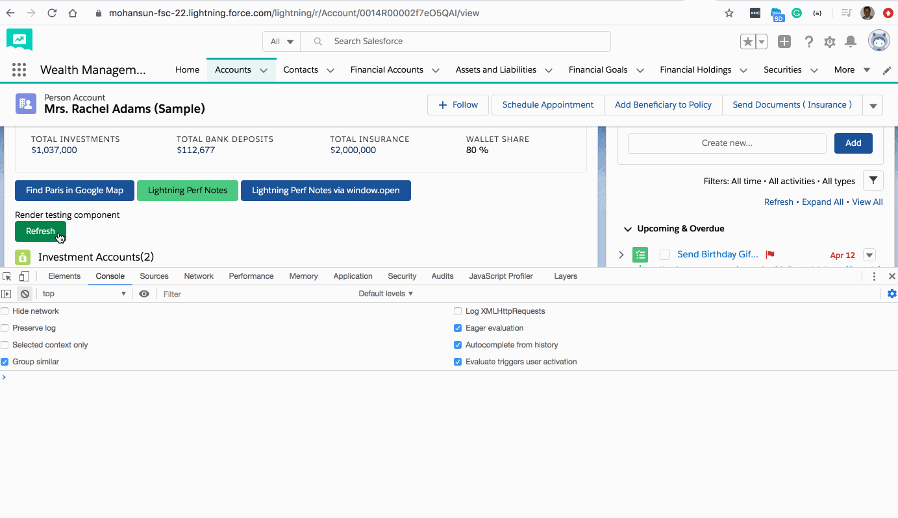

## Lightning Component Life Cycle notes


### Overview

- The base component in the framework is aura:component. Every component extends this base component.

- The renderer for aura:component is in componentRenderer.js. 
- This renderer has base implementations for the four phases of the rendering and rerendering cycles:
    - render()
    - rerender()
    - afterRender()
    - unrender()
- The framework calls these functions as part of the rendering and rerendering lifecycles 


### Rendering Lifecycle
- The rendering lifecycle happens once in the lifetime of a component unless the component gets explicitly unrendered. When you create a component:
    - The framework fires an **init** event, enabling you to update a component or fire an event after component construction but **before rendering**.
    - The **render()** method is called to render the component’s body.
    - The **afterRender()** method is called to enable you to interact with the DOM tree after the framework’s rendering service has inserted DOM elements.
    - The framework fires a render event, enabling you to interact with the DOM tree after the framework’s rendering service has inserted DOM elements. Handling the render event is preferred to creating a custom renderer and overriding afterRender().


### Rerendering Lifecycle
- The rerendering lifecycle automatically handles rerendering of components whenever the underlying data changes. Here is a typical sequence.
    - A browser event triggers one or more Lightning events.
    - Each Lightning event triggers one or more actions that can update data. The updated data can fire more events.
    - The rendering service tracks the stack of events that are fired.
    - The framework rerenders all the components that own modified data by calling each component’s rerender() method.
    - The framework fires a render event, enabling you to interact with the DOM tree after the framework rerenders a component. 
        - Handling the **render** event is preferred to creating a custom renderer and overriding rerender().


### References
- [Base Component Rendering](https://developer.salesforce.com/docs/atlas.en-us.lightning.meta/lightning/js_renderers.htm)
- [Event Handling Lifecycle](https://developer.salesforce.com/docs/atlas.en-us.lightning.meta/lightning/events_overview.htm)
- [doneRendering](https://developer.salesforce.com/docs/component-library/bundle/aura:doneRendering/documentation)
### Demo


### Component
```xml
<aura:component implements="force:appHostable,flexipage:availableForAllPageTypes,flexipage:availableForRecordHome,force:hasRecordId,forceCommunity:availableForAllPageTypes,force:lightningQuickAction" access="global" >
   <p>Render testing component</p>
   <aura:handler name="init" value="{!this}" action="{!c.doInit}"/>
   <aura:handler name="render" value="{!this}" action="{!c.onRender}"/>
   <lightning:button variant="success"  title="Refresh"  label="Refresh" onclick="{! c.onRefresh }"/> 
</aura:component>	
```
### Component controller
```js
({
    onInit : function(component, event, helper) {
        console.log('onInit');
    },
 
    onRender : function(component, event, helper) {
        console.log('onRender');
    },
 
    onRefresh : function(component, event, helper) {
        console.log('onRefresh');
        $A.get('e.force:refreshView').fire();
    }
})

```
