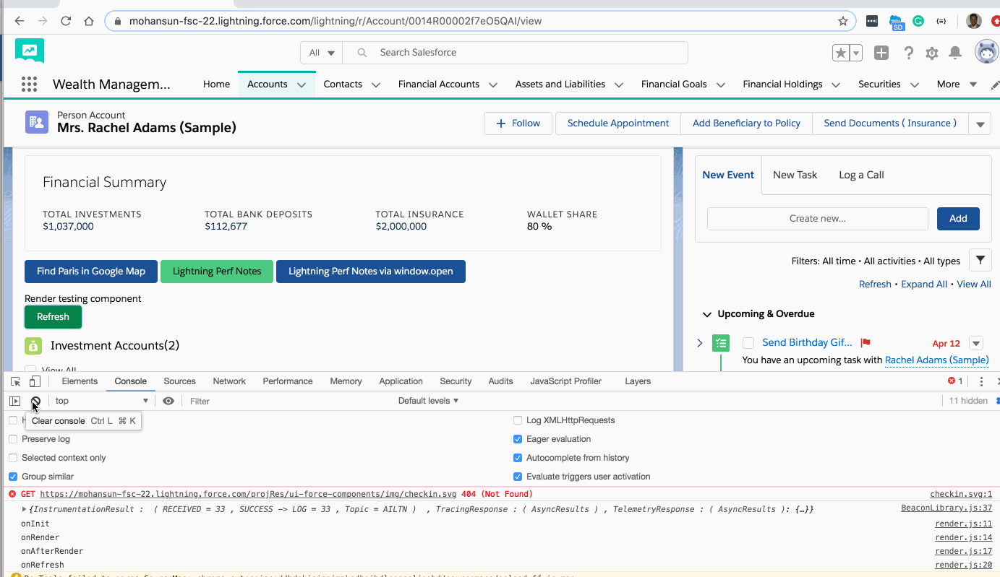

## Lightning Component Life Cycle notes


### Phases
- init event 
    - Updates a component or fires an event after component construction but before rendering.
- render()
    -  Renders the component body
- rerender()
    - the framework calls the individual reRender method of each component when there a significant even based data change. render event is again fired after this. 
- afterRender()
    - Enables you to interact with framework after the component bodies are inserted.
- unrender()


### References
- [Event Handling Lifecycle](https://developer.salesforce.com/docs/atlas.en-us.lightning.meta/lightning/events_overview.htm)

### Demo


### Component
```xml
<aura:component implements="force:appHostable,flexipage:availableForAllPageTypes,flexipage:availableForRecordHome,force:hasRecordId,forceCommunity:availableForAllPageTypes,force:lightningQuickAction" access="global" >
   <aura:handler name="render" value="{!this}" action="{!c.onInit}"/>
   
   <aura:handler name="render" value="{!this}" action="{!c.onRender}"/>
   <aura:handler name="render" value="{!this}" action="{!c.onAfterRender}"/>


   <p>Render testing component</p>

   <lightning:button variant="success"  title="Refresh"  
                              label="Refresh" 
                              onclick="{! c.onRefresh }"/>

</aura:component>	

```
### Component controller
```js
({
    onInit : function(component, event, helper) {
        console.log('onInit');
    },
 
    onRender : function(component, event, helper) {
        console.log('onRender');
    },
 
    onAfterRender : function(component, event, helper) {
        console.log('onAfterRender');
    },
    
    onRefresh : function(component, event, helper) {
        console.log('onRefresh');
        $A.get('e.force:refreshView').fire();
    }
})

```
