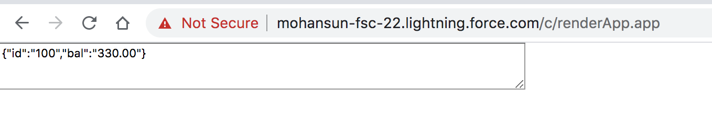

``` xml 

<aura:component implements="force:appHostable,flexipage:availableForAllPageTypes,flexipage:availableForRecordHome,force:hasRecordId,forceCommunity:availableForAllPageTypes,force:lightningQuickAction" access="global" >
   <ltng:require scripts="{!$Resource.bal}" afterScriptsLoaded="{!c.afterScriptsLoaded}" />
   <aura:attribute name="bal" type="String"/>
   <textarea rows="3" cols="80"> {!v.bal} </textarea> 
</aura:component>

```

### JS file to be in static resources as bal
```js 

// bal.js

window.getBal = async () => {
  //const url = "https://mohansun-rum.herokuapp.com/bal/100/300";
  const url = "https://localhost:5001/bal/100/300"; // make sure this has right certs and in CSP entry
  let response = await fetch(url);
  return await response.json()
}

```
i
### Component controller

```js

  ({

        afterScriptsLoaded: function (cmp, event, helper) {
   	        window.getBal().then(data => { cmp.set('v.bal', JSON.stringify(data)); });
        },

  )}

```

### If the localhost is self-signed you will get this warning in browser address bar


