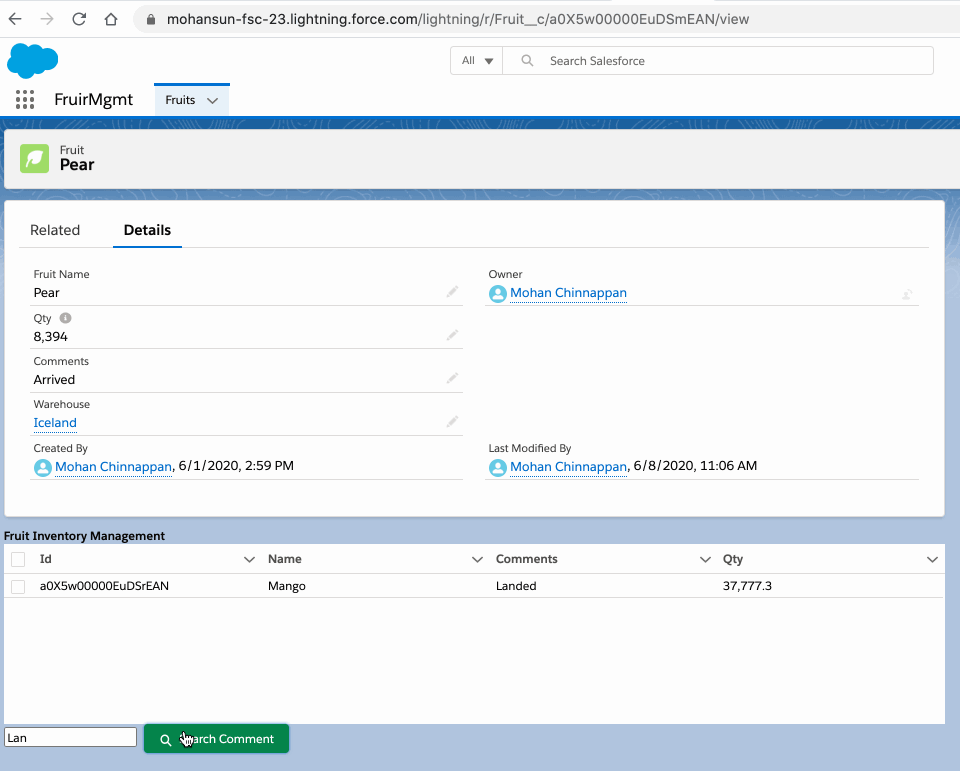

## Aggregate query in Apex for LWC datatable

- 


### Apex code

```java

public with sharing class FruitMgmt {
   @AuraEnabled(cacheable=true)
   public static List<Fruit__c>  getFruits(){ 
        return [SELECT Id , Name, Qty__c,  Comments__c FROM Fruit__c ] ;
   }
   @AuraEnabled
   public static void updateFruitComments(String[] ids, String comment) {
        Fruit__c[] fruits = [
            SELECT Id, Name, Comments__c
                    FROM Fruit__c
                    WHERE Id = :ids  
        ];

        //System.debug(fruits.size());
        for (Fruit__c fruit : fruits) {
            fruit.Comments__c = comment;
        }
        update fruits; // bulk update
   }

   @AuraEnabled(cacheable=true)
   public static List<Fruit__c>  getFruitsSearch(String comment){ 
        List <Fruit__c> fruitList = new List<Fruit__c>();
        string query = 'SELECT Id, Name, Comments__c, Qty__c FROM Fruit__c' ; 
        if( !String.isEmpty(comment) ){
            query += ' WHERE Comments__c LIKE ' + '\'%'+ comment + '%\'';
        }
        fruitList = Database.query(query);
        for (Fruit__c fruit: fruitList) {
              fruit.Qty__c = getQty(fruit.Name); // get the aggregated value
        }
        return fruitList;
   }

   // simulated aggregate query
   @AuraEnabled(cacheable=true)
   public static Decimal  getQty(String name) { 
     List<AggregateResult> result = [
           SELECT SUM(Qty__c) sqty FROM Fruit__c  WHERE Name=:name GROUP BY Name
      ];
      if (result.size() > 0) {
           Decimal sqty =  (Decimal) result[0].get('sqty');  
           return sqty * 1.1;
      } else return null;

   }


}


```
