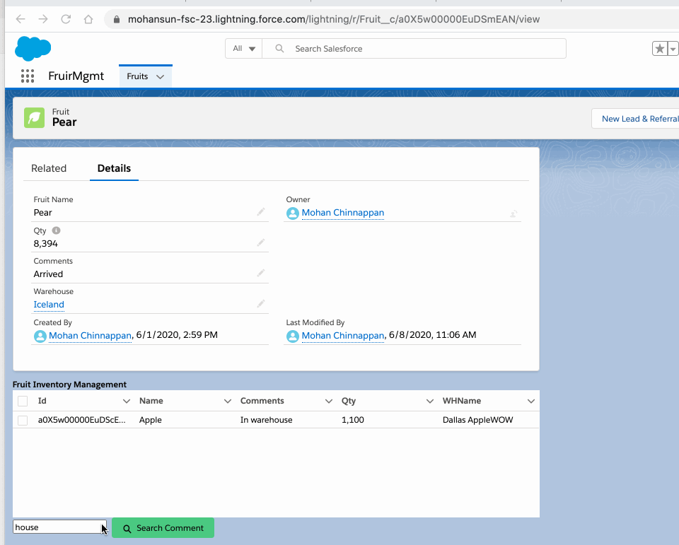

## Promise Chaining with Promise.all

### Demo




### Markup

```

     <div style="height: 200px;">
            <lightning-datatable key-field="id" data={myFruits} columns={columns}
            onrowselection={handleRowAction}>
            </lightning-datatable>
            
            <input type="text" onchange={handleCommentInput} placeholder="comment here" />
            <lightning-button variant='success' label='Search Comment' class="slds-m-left_x-small"
                onclick={handleCommentSearch} icon-name="utility:search"></lightning-button>
     </div>

```
### code

```js


const columns = [
  { label: "Id", fieldName: "Id", type: "Id" },
  { label: "Name", fieldName: "Name" },
  { label: "Comments", fieldName: "Comments__c" },
  {
    label: "Qty",
    fieldName: "Qty__c",
    type: "number",
    cellAttributes: { alignment: "left" }
  },
  { label: "WHName", fieldName: "WHName" }
];


  handleCommentSearch(event) {
    getFruitsSearch({
      comment: this.comment
    }).then((result) => {
      // Since we made this result object immutable to protect integrity of the cache
      // - we need to copy the results to mappedResult
      //  and add required mapping
      this._mappedFruits = result.map((rec) => ({
        ...rec,
        WHName: rec.Warehouse__r.Name // add new fields here
      }));
     
      // prepare for Promise.all call
      let promises = [];
      this._mappedFruits.forEach( (rec, index) => {
        promises.push( augment( {name: rec.Name}));
      });
      Promise.all(promises).then((values) => {
        values.forEach( (value, index) => {
           this._mappedFruits[index].WHName += ' ' +  value; 
        });
        this.myFruits = this._mappedFruits;
      }); 
      // TODO: error handling
    });
  }

```

### Apex

```java

 @AuraEnabled(cacheable=true)
   public static String augment(String name) {
        return name + 'WOW';
   }


```

