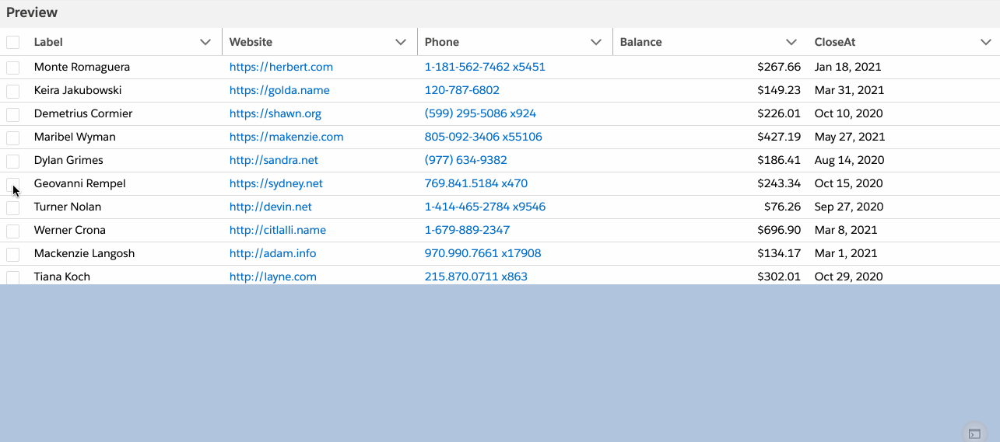

## Code to show how add a comment to multiple selected records in ightning-datatable


### In playground
[Demo in playground](https://developer.salesforce.com/docs/component-library/tools/playground/eHtjcHR8J/15/edit)


### Demo


### Markup - app.html
```html
<template>
	<div style="height: 300px;">
		<lightning-datatable key-field="id" data={data} columns={columns} onrowselection={handleRowAction}>
		</lightning-datatable>
	</div>

	<template if:true={selectedRows}>
		<input type="text" onchange={handleCommentInput} placeholder="comment here"/> 
    <template if:true={comment}>
    <lightning-button variant='brand' label='Update Comment' class="slds-m-left_x-small"
        onclick={handleComment}
        icon-name="utility:comments"

        ></lightning-button>
    </template>
       
 </template>

</template>

```

### app.js

```js
import { LightningElement } from 'lwc';
import fetchDataHelper from './fetchDataHelper';


const columns = [
    { label: 'Label', fieldName: 'name' },
    { label: 'Website', fieldName: 'website', type: 'url' },
    { label: 'Phone', fieldName: 'phone', type: 'phone' },
    { label: 'Balance', fieldName: 'amount', type: 'currency' },
    { label: 'CloseAt', fieldName: 'closeAt', type: 'date' },

];


export default class App extends LightningElement {
    data = [];
    columns = columns;

    // eslint-disable-next-line @lwc/lwc/no-async-await
    async connectedCallback() {
        const data = await fetchDataHelper({ amountOfRecords: 100 });
        this.data = data;
    }


   comment = null;
   handleCommentInput(event) {
       this.comment = event.target.value;
   }

    handleComment(event) {
        // we have selected rows in this.selectedRows
        this.selectedRows.forEach((row, index) => {
            console.log(JSON.stringify(row));
            console.log(`comment: ${this.comment}`);
            // do the required updates here

        });
    }
    selectedRows = null;

    handleRowAction(event) {
        this.selectedRows = event.detail.selectedRows;

    }
}


```

### Data fetch helper:  fetchDataHelper.js

```js
const recordMetadata = {
    name: 'name',
    email: 'email',
    website: 'url',
    amount: 'currency',
    phone: 'phoneNumber',
    closeAt: 'dateInFuture',
};

export default function fetchDataHelper({ amountOfRecords }) {
    return fetch('https://data-faker.herokuapp.com/collection', {
        method: 'POST',
        headers: {
            'Content-Type': 'application/json; charset=utf-8',
        },
        body: JSON.stringify({
            amountOfRecords,
            recordMetadata,
        }),
    }).then(response => response.json());
}

```
