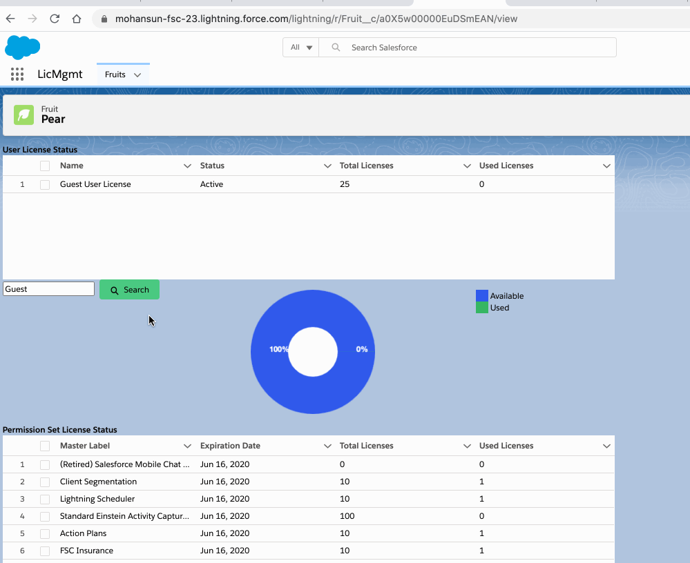
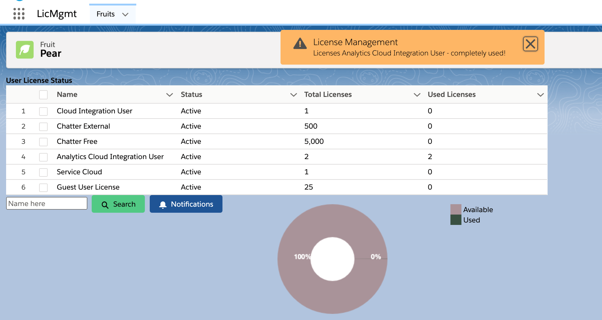

## User License and Permission Set Licenses Info

### Demo



### Notifications



### Getting License usage info via SFDX 
```bash

$ sfdx force:data:soql:query -u mohan.chinnappan.fsc@gmail.com -q "SELECT Name,Status,TotalLicenses,UsedLicenses FROM UserLicense"
NAME                              STATUS    TOTALLICENSES  USEDLICENSES
────────────────────────────────  ────────  ─────────────  ────────────
Salesforce                        Active    20             1
Chatter Free                      Active    5000           1
Salesforce Platform               Active    30             2
Analytics Cloud Integration User  Disabled
Partner Community                 Disabled
Partner Community Login           Disabled
Customer Community Login          Disabled
Customer Community Plus           Disabled
Customer Community                Disabled
Identity                          Disabled
XOrg Proxy User                   Disabled
Gold Partner                      Active    30
Partner App Subscription          Disabled
Authenticated Website             Disabled
High Volume Customer Portal       Disabled
Customer Portal Manager Custom    Active    50
Work.com Only                     Disabled
Silver Partner                    Active    20
Force.com - Free                  Active    20
External Identity                 Disabled
Customer Portal Manager Standard  Active    50
Force.com - App Subscription      Disabled
Customer Community Plus Login     Disabled
Chatter External                  Active    500
High Volume Customer Portal       Active    100
Cloud Integration User            Active    1
Guest                             Active    1
Total number of records retrieved: 27


$ sfdx force:data:soql:query -u mohan.chinnappan.fsc@gmail.com -q "SELECT MasterLabel, ExpirationDate,TotalLicenses, UsedLicenses FROM PermissionSetLicense"
MASTERLABEL                                  EXPIRATIONDATE  TOTALLICENSES  USEDLICENSES
───────────────────────────────────────────  ──────────────  ─────────────  ────────────
Sales Console User                           null            20
Orders Platform                              null
Identity Connect                             null
Field Service Scheduling                     null            10
Field Service Mobile                         null            10
Field Service Dispatcher                     null            10
Field Service Standard                       null            50
Financial Services Cloud Standard            null            10             1
Financial Services Cloud Basic               null            10             1
FSC Insurance                                null            10             1
Lightning Scheduler                          null            10
Einstein Analytics Plus                      null            1              1
FSC Analytics Apps                           null            1              1
Mortgage                                     null            10
Customer Experience Analytics Apps           null            1
(Retired) Salesforce Mobile Chat Experience  null
Total number of records retrieved: 16.


```

### Create a Custom Report Type for Salesforce User Licenses

- NOTE permission need for this operation
    - To create and update custom report types
    - [Help Doc](https://help.salesforce.com/articleView?id=reports_defining_report_types.htm&type=5)

- Here's how to create a custom report type to display licenses used by each User in your organization:

1. Click Setup.
2. Access Report Types:

    - Salesforce Classic: Under "Build," click Create | select Report Type.
    - Salesforce Lightning: Go to Feature Settings | Analytics | Reports & Dashboards | Select Report Types.

3. Click New Custom Report Type.
4. In the "Primary Object" field, select Users.
5. Enter a name, label, description, and category for your new report.
6. Select a deployment status.
7. Click Next, then click Save.
8. Click Edit Layout.
9. Under "View," click Add fields related via lookup.
10. Click Profile.
11. Select User License, then click View related fields.
12. Select Name, Status, and Total Licenses, then click OK.
13. Click Save.
14. Click the Reports tab.
15. Click New Report.
16. Click the folder (category) you saved your report to, then select your new User Licenses Report.
17. Click Create.
18. Under "Fields," drag and drop Profile: User License: Name to the report preview.
19. Click Run Report.

- [Knowledge Article:Create a Custom Report Type for Salesforce User Licenses](https://help.salesforce.com/articleView?id=000337772&type=1&mode=1)


### Demo of the report creation
- 

### How to the above result data in JSON via SFDX

```bash

$ sfdx force:data:soql:query -u mohan.chinnappan.fsc@gmail.com -q "SELECT user.id, user.Email, user.FirstName, user.LastName, user.profile.Name, user.Username, user.IsActive, user.profile.userLicense.TotalLicenses  FROM user, user.profile, profile.userLicense" --json
```
```json
{
  "status": 0,
  "result": {
    "totalSize": 9,
    "done": true,
    "records": [
      {
        "attributes": {
          "type": "User",
          "url": "/services/data/v48.0/sobjects/User/0053h000002fIZxAAM"
        },
        "Id": "0053h000002fIZxAAM",
        "Email": "autoproc@00d3h000003yzckeau",
        "FirstName": "Automated",
        "LastName": "Process",
        "Profile": null,
        "Username": "autoproc@00d3h000003yzckeau",
        "IsActive": true
      },
      {
        "attributes": {
          "type": "User",
          "url": "/services/data/v48.0/sobjects/User/0053h000002fIa1AAE"
        },
        "Id": "0053h000002fIa1AAE",
        "Email": "automatedclean@00d3h000003yzckeau",
        "FirstName": null,
        "LastName": "Data.com Clean",
        "Profile": null,
        "Username": "automatedclean@00d3h000003yzckeau",
        "IsActive": true
      },
      {
        "attributes": {
          "type": "User",
          "url": "/services/data/v48.0/sobjects/User/0053h000002moCrAAI"
        },
        "Id": "0053h000002moCrAAI",
        "Email": "mohan.chinnappan.n@gmail.com",
        "FirstName": "helpcenter",
        "LastName": "Site Guest User",
        "Profile": {
          "attributes": {
            "type": "Profile",
            "url": "/services/data/v48.0/sobjects/Profile/00e3h000001TwmfAAC"
          },
          "Name": "helpcenter Profile",
          "UserLicense": {
            "attributes": {
              "type": "UserLicense",
              "url": "/services/data/v48.0/sobjects/UserLicense/1003h0000014mJTAAY"
            },
            "TotalLicenses": 1
          }
        },
        "Username": "helpcenter@cx-mohan-developer-edition.na111.force.com",
        "IsActive": true
      },
      {
        "attributes": {
          "type": "User",
          "url": "/services/data/v48.0/sobjects/User/0053h000002fIZwAAM"
        },
        "Id": "0053h000002fIZwAAM",
        "Email": "integration@example.com",
        "FirstName": "Integration",
        "LastName": "User",
        "Profile": {
          "attributes": {
            "type": "Profile",
            "url": "/services/data/v48.0/sobjects/Profile/00e3h000001QJtoAAG"
          },
          "Name": "Analytics Cloud Integration User",
          "UserLicense": {
            "attributes": {
              "type": "UserLicense",
              "url": "/services/data/v48.0/sobjects/UserLicense/1003h0000012Ef9AAE"
            },
            "TotalLicenses": 0
          }
        },
        "Username": "integration@00d3h000003yzckeau.com",
        "IsActive": true
      },
      {
        "attributes": {
          "type": "User",
          "url": "/services/data/v48.0/sobjects/User/0053h000002fIa3AAE"
        },
        "Id": "0053h000002fIa3AAE",
        "Email": "fanthony@example.com",
        "FirstName": "Ryan",
        "LastName": "Dobson",
        "Profile": {
          "attributes": {
            "type": "Profile",
            "url": "/services/data/v48.0/sobjects/Profile/00e3h000001QJtuAAG"
          },
          "Name": "Standard Platform User",
          "UserLicense": {
            "attributes": {
              "type": "UserLicense",
              "url": "/services/data/v48.0/sobjects/UserLicense/1003h0000012Ef8AAE"
            },
            "TotalLicenses": 30
          }
        },
        "Username": "rdobs.0eueptlaeyb6.zbfqsapxqyvo@gmail.com",
        "IsActive": true
      },
      {
        "attributes": {
          "type": "User",
          "url": "/services/data/v48.0/sobjects/User/0053h000002fIa4AAE"
        },
        "Id": "0053h000002fIa4AAE",
        "Email": "fanthony@example.com",
        "FirstName": "Srilakshmi",
        "LastName": "Maajid",
        "Profile": {
          "attributes": {
            "type": "Profile",
            "url": "/services/data/v48.0/sobjects/Profile/00e3h000001QJtuAAG"
          },
          "Name": "Standard Platform User",
          "UserLicense": {
            "attributes": {
              "type": "UserLicense",
              "url": "/services/data/v48.0/sobjects/UserLicense/1003h0000012Ef8AAE"
            },
            "TotalLicenses": 30
          }
        },
        "Username": "sri.nbwygygqbjl3.fmssqilsqgx6@gmail.com",
        "IsActive": true
      },
      {
        "attributes": {
          "type": "User",
          "url": "/services/data/v48.0/sobjects/User/0053h000002fIa5AAE"
        },
        "Id": "0053h000002fIa5AAE",
        "Email": "insightssecurity@example.com",
        "FirstName": "Security",
        "LastName": "User",
        "Profile": {
          "attributes": {
            "type": "Profile",
            "url": "/services/data/v48.0/sobjects/Profile/00e3h000001QJtvAAG"
          },
          "Name": "Analytics Cloud Security User",
          "UserLicense": {
            "attributes": {
              "type": "UserLicense",
              "url": "/services/data/v48.0/sobjects/UserLicense/1003h0000012Ef9AAE"
            },
            "TotalLicenses": 0
          }
        },
        "Username": "insightssecurity@00d3h000003yzckeau.com",
        "IsActive": true
      },
      {
        "attributes": {
          "type": "User",
          "url": "/services/data/v48.0/sobjects/User/0053h000002fIZrAAM"
        },
        "Id": "0053h000002fIZrAAM",
        "Email": "mohan.chinnappan.n@gmail.com",
        "FirstName": "Mohan",
        "LastName": "Chinnappan",
        "Profile": {
          "attributes": {
            "type": "Profile",
            "url": "/services/data/v48.0/sobjects/Profile/00e3h000001QJtnAAG"
          },
          "Name": "System Administrator",
          "UserLicense": {
            "attributes": {
              "type": "UserLicense",
              "url": "/services/data/v48.0/sobjects/UserLicense/1003h0000012Ef2AAE"
            },
            "TotalLicenses": 20
          }
        },
        "Username": "mohan.chinnappan.fsc201@gmail.com",
        "IsActive": true
      },
      {
        "attributes": {
          "type": "User",
          "url": "/services/data/v48.0/sobjects/User/0053h000002fIa2AAE"
        },
        "Id": "0053h000002fIa2AAE",
        "Email": "noreply@chatter.salesforce.com",
        "FirstName": null,
        "LastName": "Chatter Expert",
        "Profile": {
          "attributes": {
            "type": "Profile",
            "url": "/services/data/v48.0/sobjects/Profile/00e3h000001QJttAAG"
          },
          "Name": "Chatter Free User",
          "UserLicense": {
            "attributes": {
              "type": "UserLicense",
              "url": "/services/data/v48.0/sobjects/UserLicense/1003h0000012Ef6AAE"
            },
            "TotalLicenses": 5000
          }
        },
        "Username": "chatty.00d3h000003yzckeau.vvveirv5y8xr@chatter.salesforce.com",
        "IsActive": true
      }
    ]
  }
}
```


