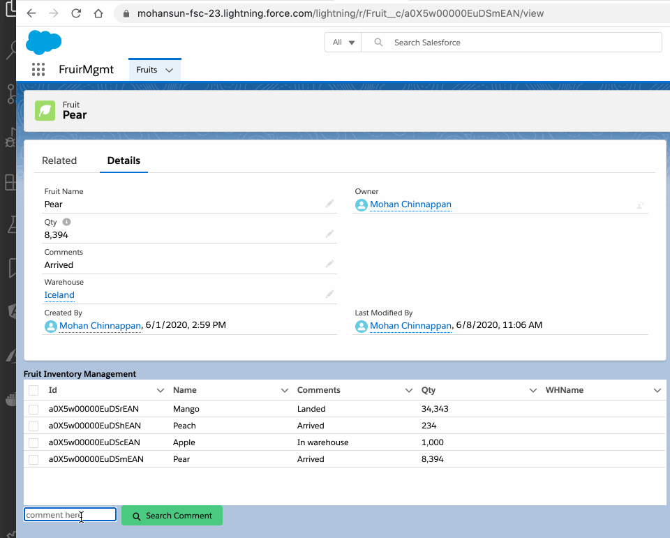

## How to add new entries into the result object (cached) to render in datatable

### Demo



### Apex

```java

   @AuraEnabled(cacheable=true)
   public static List<Fruit__c>  getFruitsSearch(String comment){ 
        List <Fruit__c> fruitList = new List<Fruit__c>();
        string query = 'SELECT Id, Name, Comments__c, Qty__c, Warehouse__r.Name  FROM Fruit__c' ; 
        if( !String.isEmpty(comment) ){
            query += ' WHERE Comments__c LIKE ' + '\'%'+ comment + '%\'';
        }
        fruitList = Database.query(query);
        for (Fruit__c fruit: fruitList) {
              fruit.Qty__c = getQty(fruit.Name); // get the aggregated value
        }
        return fruitList;
   }

```


### Handler code
```js

  handleCommentSearch(event) {
    getFruitsSearch({
      comment: this.comment
    }).then((result) => {
      // Since we made this result object immutable to protect integrity of the cache
      // - we need to copy the results to mappedResult
      //  and add required mapping
      let mappedResult = result.map((rec) => ({
        ...rec,
        WHName: rec.Warehouse__r.Name // add new fields here
      }));
      this.myFruits = mappedResult;
    });
  }


```


