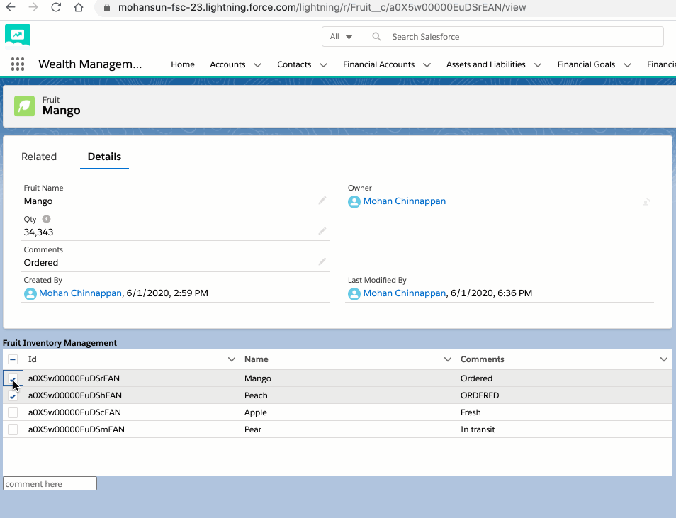

## LWC datatable  refresh example

### Use case

- List of fruits are rendered in datatable
- User selects rows
    - provide comment for those selected rows
- User clicks the **Update Comment**

- Datatable content is refreshed with newly updated comments  


### Demo

- 

### fruitMgmt.html
```html
<template>
        <lightning:card>
        <h1><b>Fruit Inventory Management</b></h1>
        <div style="height: 200px;">
            <lightning-datatable key-field="id" data={myFruits} columns={columns}
            onrowselection={handleRowAction}>
            </lightning-datatable>
        </div>

        <template if:true={selectedRows}>
            <input type="text" onchange={handleCommentInput} placeholder="comment here" />
            <template if:true={comment}>
                <lightning-button variant='brand' label='Update Comment' class="slds-m-left_x-small"
                    onclick={handleComment} icon-name="utility:comments"></lightning-button>
            </template>

        </template>
    </lightning:card>

</template>

```

### fruitMgmt.js
```js

import { LightningElement, wire } from "lwc";
import { refreshApex } from "@salesforce/apex";
import getFruits from "@salesforce/apex/FruitMgmt.getFruits";
import updateFruitComments from "@salesforce/apex/FruitMgmt.updateFruitComments";

const columns = [
  { label: "Id", fieldName: "Id", type: "Id" },
  { label: "Name", fieldName: "Name" },
  { label: "Comments", fieldName: "Comments__c" }
];

export default class FruitMgmt extends LightningElement {
  columns = columns;

  myFruits;

  _myFruits;

  @wire(getFruits)
  wiredCallback(result) {
    this._myFruits = result;
    if (result.data) {
      this.myFruits = result.data;
      this.error = undefined;
    } else if (result.error) {
      this.error = result.error;
      this.parameters = undefined;
    }
  }

  comment = null;
  handleCommentInput(event) {
    this.comment = event.target.value;
  }

  handleComment(event) {
    // we have selected rows in this.selectedRows
    let ids = []; // collect Ids
    this.selectedRows.forEach((row, index) => {
      // console.log(JSON.stringify(row));
      ids.push(row.Id);
    });
    // do the required updates here
    updateFruitComments({
      ids: ids,
      comment: this.comment
    })
      .then(() => {
        // refresh the backend
        return refreshApex(this._myFruits);
      })
      .catch((error) => {
        this.message =
          "Error received: code" +
          error.errorCode +
          ", " +
          "message " +
          error.body.message;
      });
  }
  
  selectedRows = null;
  handleRowAction(event) {
    this.selectedRows = event.detail.selectedRows;
  }
}

```

### FruitMgmt.cls
```java

public with sharing class FruitMgmt {
   @AuraEnabled(cacheable=true)
   public static List<Fruit__c>  getFruits(){ 
        return [SELECT Id , Name,  Comments__c FROM Fruit__c ] ;
   }
   @AuraEnabled
   public static void updateFruitComments(String[] ids, String comment) {
        Fruit__c[] fruits = [
            SELECT Id, Name, Comments__c
                    FROM Fruit__c
                    WHERE Id = :ids  
        ];
        for (Fruit__c fruit : fruits) {
            fruit.Comments__c = comment;
        }
        update fruits; // bulk update
   }
}


```
