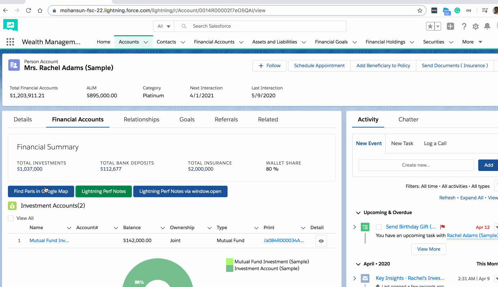

## Aura Component - Navigate to url  notes

- If the component is displayed inside the one.app the following will work
    - ```e.force:navigateToURL```
        - This event is handled by the one.app container. It’s supported in Lightning Experience, Salesforce app, and Lightning communities.
    - ```<lightning:navigation aura:id="navigationService" />```
        - Recommended method

- If the component is not in one.app container the following may be used 
    - ```window.open(url, windowName, pref)```
        - Make sure the url you put here is safe, https based, enterprise sso-enable etc... 


### References

- [Aura Component Navigation](https://developer.salesforce.com/docs/component-library/bundle/lightning:navigation/documentation)
- [Navigate to a Web Page](https://developer.salesforce.com/docs/atlas.en-us.lightning.meta/lightning/components_navigation_web_page.htm?search_text=lightning:navigate)
- [Aura Component Navigate To Url](https://developer.salesforce.com/docs/component-library/bundle/force:navigateToURL/documentation)


### Sample Code 

- Component - navigate.cmp 

``` xml
<aura:component implements="force:appHostable,flexipage:availableForAllPageTypes,flexipage:availableForRecordHome,force:hasRecordId,forceCommunity:availableForAllPageTypes,force:lightningQuickAction" access="global" >

<aura:attribute name="address"   default="Paris" type="String" />

<lightning:button variant="brand"  title="Find Paris in Google Map"  
                              label="Find Paris in Google Map" 
                              onclick="{! c.navigateToParis }"/>


<lightning:button variant="success"  title="Lightning Perf Notes"  
                              label="Lightning Perf Notes" 
                              onclick="{! c.navigateToLexPerf }"/>

<lightning:navigation aura:id="navigationService" />

<lightning:button variant="brand"  title="Lightning Perf Notes via window.open"  
                              label="Lightning Perf Notes via window.open" 
                              onclick="{! c.navigateToLexPerfViaWindowOpen }"/>


    

</aura:component>	
```

 - Controller - navigateController.js
``` js

({
    navigateToParis : function(component, event, helper) {
        var address = component.get("v.address");
    
        var urlEvent = $A.get("e.force:navigateToURL");
        urlEvent.setParams({
          "url": 'https://www.google.com/maps/place/' + address
        });
        urlEvent.fire();
    },


    navigateToLexPerf: function(cmp){
        cmp.find("navigationService").navigate({ 
            type: "standard__webPage", 
            attributes: { 
                url: 'https://mohan-chinnappan-n2.github.io/2019/lex/perf.html' 
            } 
        });
    },

    navigateToLexPerfViaWindowOpen: function(cmp){
        const url = 'https://mohan-chinnappan-n2.github.io/2019/lex/perf.html';
        const windowName = 'LEXPerf';
        const pref = "menubar=yes,location=yes,resizable=yes,scrollbars=yes,status=yes";
        window.open(url, windowName, pref);

    }

})

```


- App (for non one.app testing) - navapp.app
```
<aura:application extends="force:slds">
    <c:navigate />
</aura:application>


```


### Demos

- Inside one.app container



- Outside one.app container

